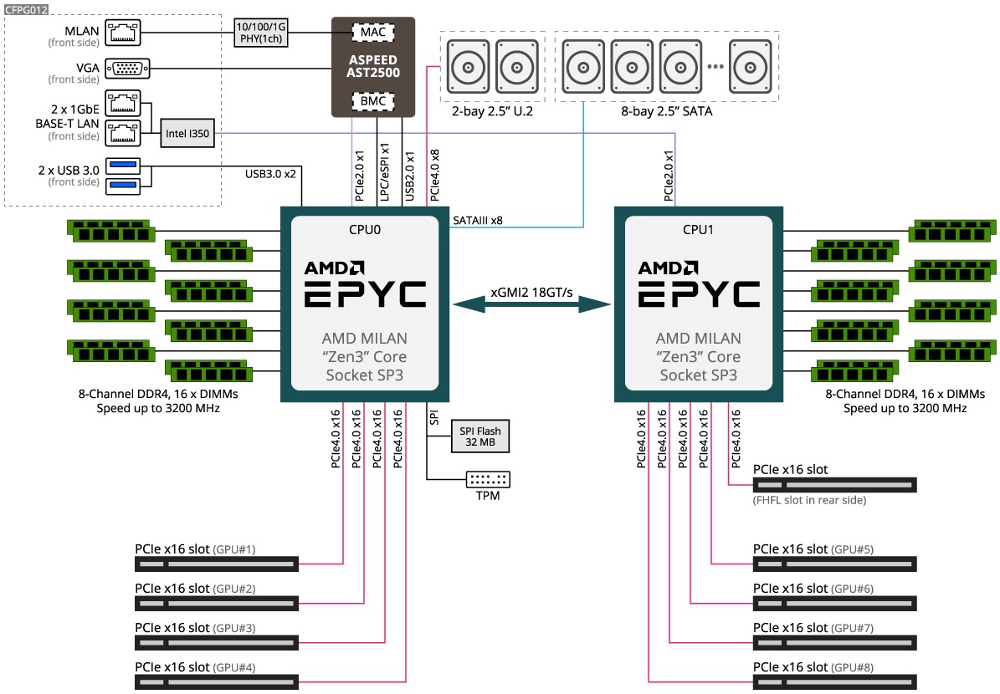

# Cluster

## Server Information

### gala1

- 4U server - PCIe 4.0 (Chassis similar to Gigabyte G482-Z54)
- CPU: 2 x 28 CPU cores (AMD EPYC Zen 3, 7453)
- GPU: 8 x Nvidia A5000 (NVLinked, 4 pairs)
- Memory: 1TB DDR4 3200MHz (16 x 64GB)
- NVMe SSD: 2 x 3.84TB (Intel P5510, PCIe 4.0)
- SATA SSD: 1.92TB (Intel S4510)
- 1 Gbps NIC (Future expansion to have InfiniBand)



### jazz1

- Workstation server - PCIe 4.0
- CPU: 1 x 16 CPU cores (AMD Ryzen 9, 5950X)
- GPU: 1 x Nvidia 3090
- Memory: 128 DDR4 3200MHz (4 x 32GB)
- NVMe SSD: 1 x 2TB (Samsung 980 Pro, M.2, PCIe 4.0)
- SATA SSD: 1 x 4TB (Samsung 870 QVO)

### Jetson AGX Orin Developer Kit

- CPU: 1 x 12 CPU cores (Arm® Cortex®-A78AE v8.2)
- SD Card: 1 x 128GB
- NVMe SSD: TBD


**IMPORTANT**: The server can only be accessed within Informatics firewall through Ethernet cables in side building or proxy jump through `ssh.inf.ed.ac.uk`

## Create User

```bash
sudo useradd -m -s /usr/bin/bash -G sudo <username> # user WITH root privileges
sudo useradd -m -s /usr/bin/bash <username>         # user WITHOUT root privileges

sudo passwd <username>             # set user password
```

After the default passward is set for users, they can login and change their own password by `passwd`

## Storage

```bash
sudo usermod -aG storage <username>
```

For non-sudoers, do the following instead
```bash
sudo mkdir /mnt/raid0nvme1/<username>
sudo chown <username>:<username> /mnt/raid0nvme1/<username>
```

**IMPORTANT**: Home directory is only for downloads, compilation. Put data on NVMe SSD under `/mnt/raid0nvme1`

## Remote Access

For users want to have ssh access by public/private key pair
```bash
ssh-copy-id <username>@gala1   # execute on local machine with key pair
ssh <username>@gala1
```

## Software Stack

Add user to anaconda group

```bash
sudo usermod -aG anaconda3 <username>
sudo usermod -aG docker <username>      # docker access
sudo usermod -aG microk8s <username>    # standalone k8s accress
```

Add the following to .bashrc or .zshrc
```bash
# >>> conda initialize >>>
# !! Contents within this block are managed by 'conda init' !!
__conda_setup="$('/home/gala1/anaconda3/bin/conda' 'shell.bash' 'hook' 2> /dev/null)"
if [ $? -eq 0 ]; then
    eval "$__conda_setup"
else
    if [ -f "/home/gala1/anaconda3/etc/profile.d/conda.sh" ]; then
        . "/home/gala1/anaconda3/etc/profile.d/conda.sh"
    else
        export PATH="/home/gala1/anaconda3/bin:$PATH"
    fi
fi
unset __conda_setup
# <<< conda initialize <<<
```

## 

```bash

sudo usermod -aG gurobi <username>

export GUROBI_HOME="/home/gala1/gurobi951/linux64"
export PATH="${PATH}:${GUROBI_HOME}/bin"
export LD_LIBRARY_PATH="${LD_LIBRARY_PATH}:${GUROBI_HOME}/lib"
```


## CUDA

```bash
export CUDA_HOME=/usr/local/<cuda version>
export PATH=${CUDA_HOME}/bin:$PATH
export LD_LIBRARY_PATH=${CUDA_HOME}/lib64:$LD_LIBRARY_PATH
```

## Disks

(Thu 31 Aug 2023 05:21:42 PM BST)

```text
/dev/sda3       1.8T  1.2T  491G  71% /
/dev/md0        7.0T  4.7T  2.0T  72% /mnt/raid0nvme1
/dev/sdb1       3.6T  2.7T  737G  79% /mnt/data
/dev/md1         15T  4.7T  9.8T  33% /mnt/raid0sata1
...
```

Please do not download dataset directly to /home directory.
