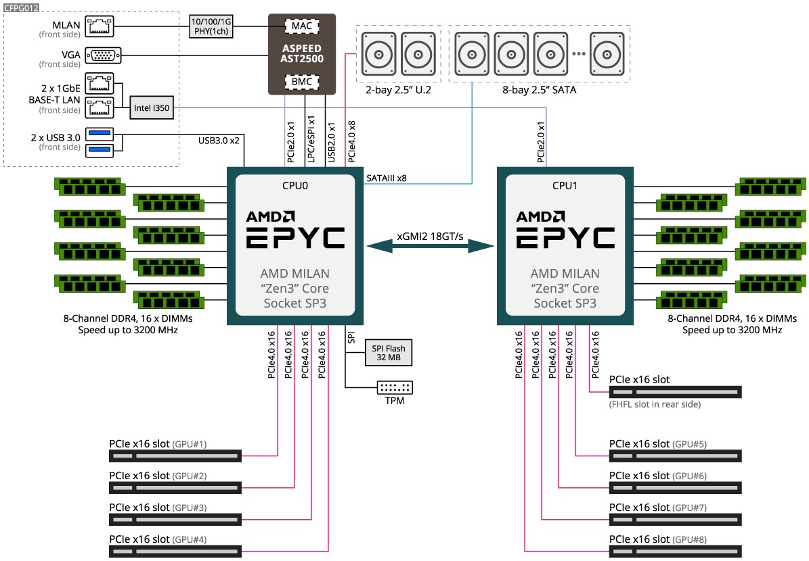

# Gala

## Server Info

- 4U server - PCIe 4.0 (Chassis similar to Gigabyte G482-Z54)
- CPU: 2 x 28 CPU cores (AMD EPYC Zen 3, 7453)
- GPU: 8 x Nvidia A5000 (NVLinked, 4 pairs)
- Memory: 1TB DDR4 3200MHz (16 x 64GB)
- NVMe SSD: 2 x 3.84TB (Intel P5510, PCIe 4.0)
- SATA SSD: 1.92TB (Intel S4510)
- 1 Gbps NIC (Future expansion to have InfiniBand)

